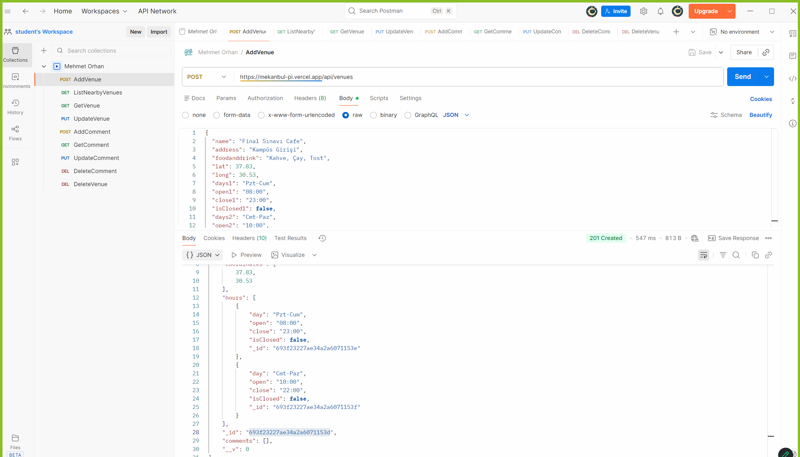
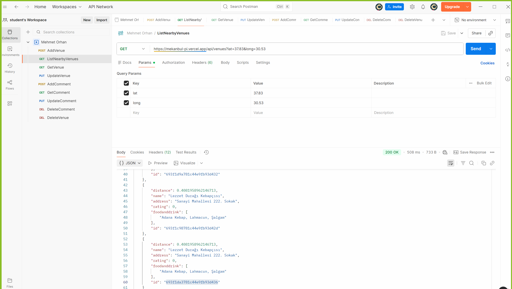
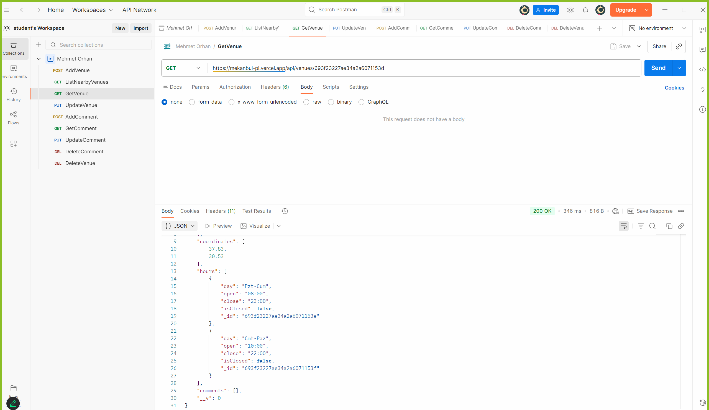
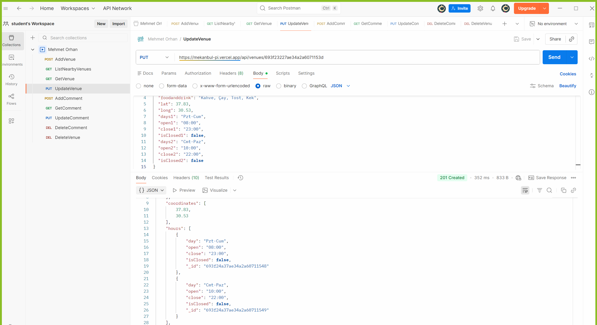
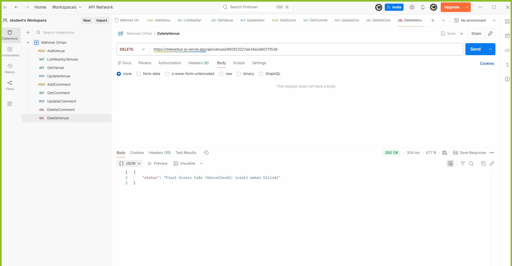
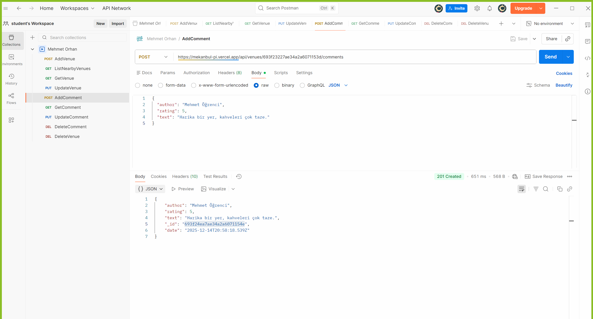
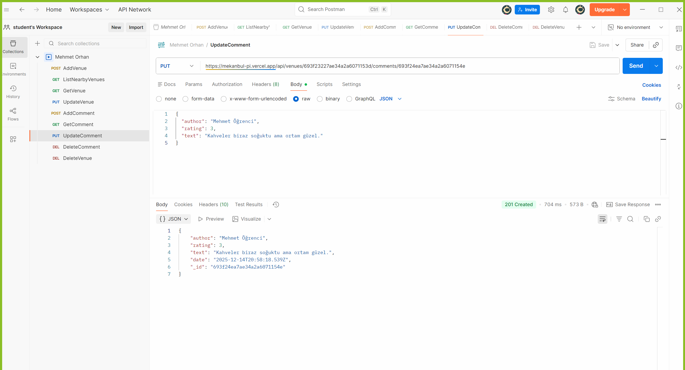
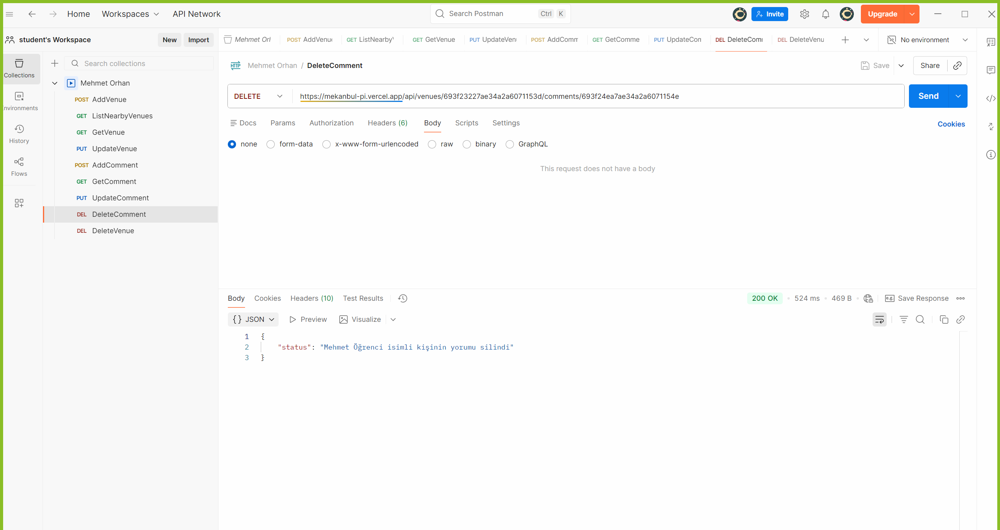

# Mekanbul Backend Projesi

Bu proje, "Mekanbul" uygulaması için geliştirilmiş, RESTful API servislerini içeren backend projesidir. Node.js, Express ve MongoDB kullanılarak geliştirilmiş ve Vercel üzerinde yayınlanmıştır.

**Canlı Demo:** [https://mekanbul-pi.vercel.app](https://mekanbul-pi.vercel.app)

---

## 📍 API Uç Noktaları (Endpoints)

Projede kullanılan tüm API adresleri ve açıklamaları aşağıdadır:

| Metot | Uç Nokta (Endpoint) | Açıklama |
| :--- | :--- | :--- |
| **GET** | `/api/venues?lat={lat}&long={long}` | Konuma göre mekanları listeler. |
| **POST** | `/api/venues` | Yeni bir mekan ekler. |
| **GET** | `/api/venues/:venueid` | Belirli bir mekanı getirir. |
| **PUT** | `/api/venues/:venueid` | Belirli bir mekanı günceller. |
| **DELETE** | `/api/venues/:venueid` | Belirli bir mekanı siler. |
| **POST** | `/api/venues/:venueid/comments` | Mekana yeni yorum ekler. |
| **GET** | `/api/venues/:venueid/comments/:commentid` | Belirli bir yorumu getirir. |
| **PUT** | `/api/venues/:venueid/comments/:commentid` | Belirli bir yorumu günceller. |
| **DELETE** | `/api/venues/:venueid/comments/:commentid` | Belirli bir yorumu siler. |

---

## 📸 API Test Ekran Görüntüleri (Kanıtlar)

Aşağıda Postman kullanılarak yapılan tüm API testlerinin başarılı sonuçları yer almaktadır.

### 1. Mekan (Venue) İşlemleri

**Mekan Ekleme (POST):**

**Yakındaki Mekanları Listeleme (GET):**

**Mekan Getir (GET):**

**Mekan Güncelleme (PUT):**

**Mekan Silme (DELETE):**

---

### 2. Yorum (Comment) İşlemleri

**Yorum Ekleme (POST):**

**Yorum Getir (GET):**

**Yorum Güncelleme (PUT):**

**Yorum Silme (DELETE):**
